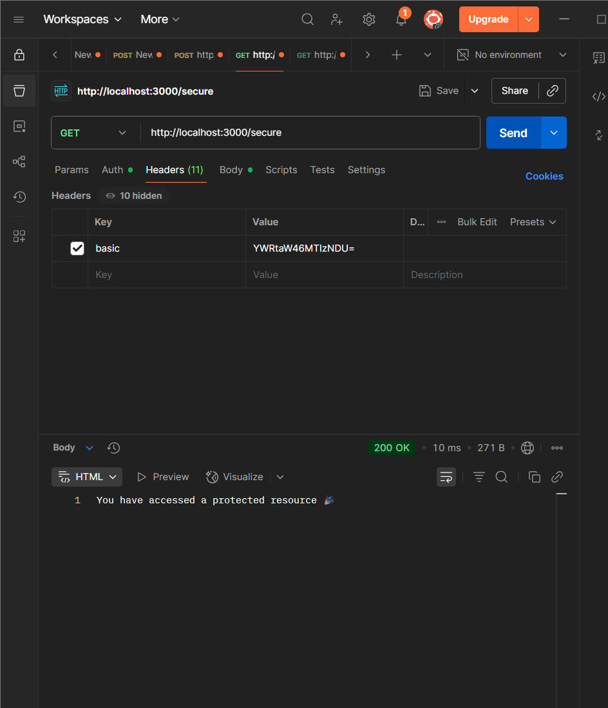
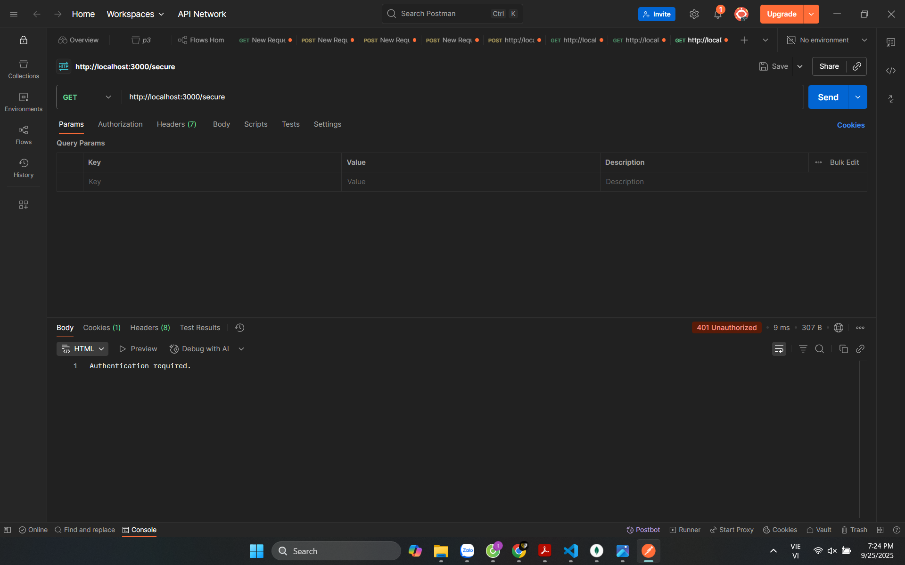
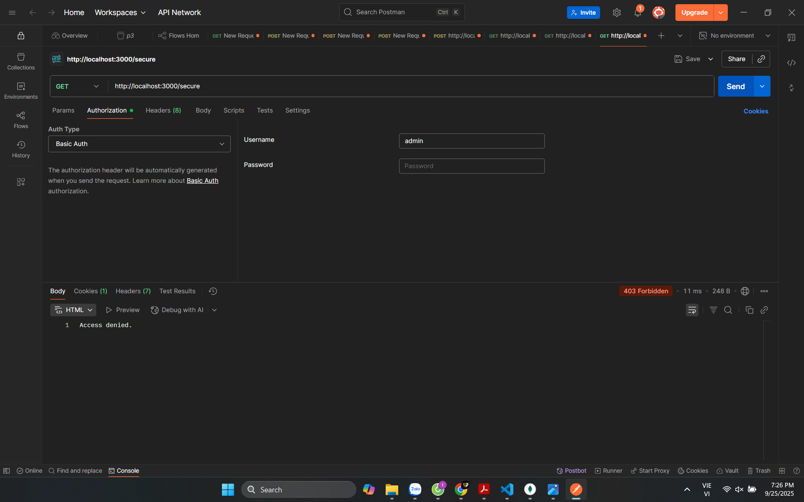

Yêu cầu hệ thống
Đã cài đặt Node.js

Postman để kiểm thử API

Cài đặt
Clone repository này

Cài đặt dependencies: npm install
Chạy Máy chủ: node basic_auth.js
Máy chủ sẽ chạy trên: http://localhost:3000
Kiểm thử Route Công khai
Mở Postman

Tạo request GET mới đến: http://localhost:3000/

Kiểm thử Route Được bảo vệ với Basic Auth
Phương pháp 1: Sử dụng Tab Auth của Postman
Tạo request GET mới đến: http://localhost:3000/secure

Tạo request GET mới đến: http://localhost:3000/secure

Chuyển đến tab Headers

Thêm header mới:

Key: Authorization

Value: Basic YWRtaW46MTIzNDU= (đây là phiên bản được mã hóa base64 của admin:12345)

Gửi request

Không có Header Xác thực (401 Unauthorized)

Thông tin Đăng nhập Không hợp lệ (403 Forbidden)

