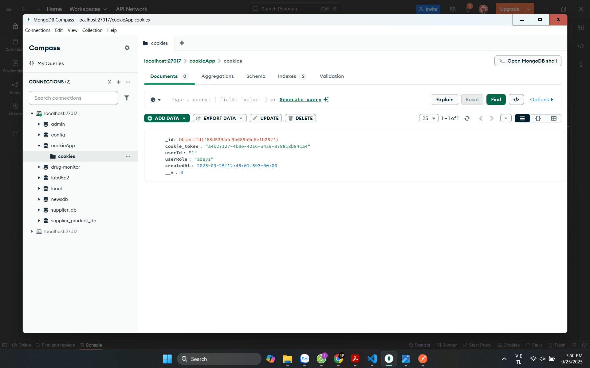

Yêu cầu hệ thống
Đã cài đặt Node.js

Postman để kiểm thử API

Cài đặt
Clone repository này

Cài đặt dependencies: npm install
Chạy Máy chủ: node basic_auth.js
Máy chủ sẽ chạy trên: http://localhost:3000
Kiểm thử Route Công khai
Mở Postman

Tạo request GET mới đến: http://localhost:3000/

Kiểm thử Route Được bảo vệ với Basic Auth
Phương pháp 1: Sử dụng Tab Auth của Postman
Tạo request GET mới đến: http://localhost:3000/secure

Tạo request GET mới đến: http://localhost:3000/secure

Chuyển đến tab Headers

Thêm header mới:

Key: Authorization

Value: Basic YWRtaW46MTIzNDU= (đây là phiên bản được mã hóa base64 của admin:12345)

Gửi request

Không có Header Xác thực (401 Unauthorized)

Thông tin Đăng nhập Không hợp lệ (403 Forbidden)

Dịch vụ Xác thực bằng Cookie
Cài đặt
lone repository

Cài đặt các dependencies: npm install
Đảm bảo MongoDB đang chạy trên mongodb://127.0.0.1:27017

Khởi động server:node cookie_auth.js
Server sẽ chạy trên http://localhost:3001
1. Đăng nhập
POST http://localhost:3001/login

Body (JSON):
{
  "username": "admin",
  "password": "12345"
}

2. Trang hồ sơ (bảo mật)
GET http://localhost:3001/profile

Yêu cầu: Phải có cookie xác thực hợp lệ từ đăng nhập

Bước 3: Đăng xuất
ạo request mới, phương thức POST

URL: http://localhost:3001/logout

